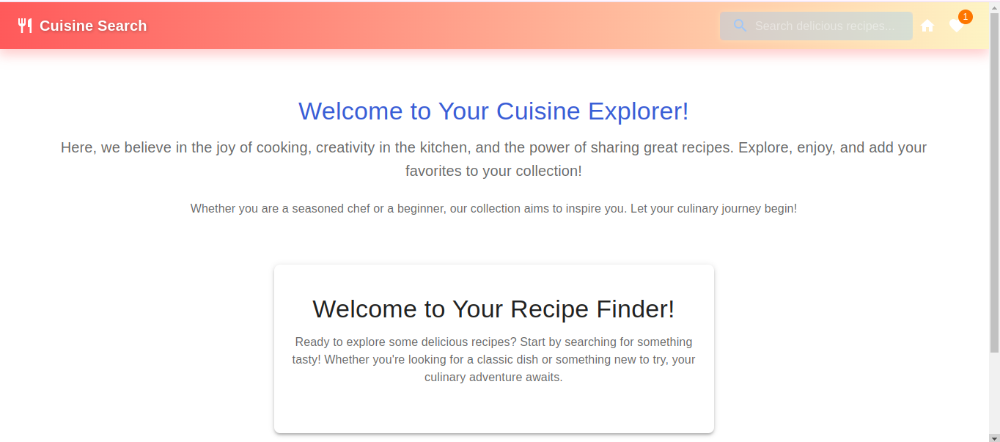

# Cuisine Search Web Application

**Cuisine Search** is your ultimate kitchen companion, designed to help food enthusiasts explore a diverse selection of recipes with ease. Whether you're looking to try vegetarian dishes, hearty meals for meat lovers, or calorie-conscious recipes for a healthier lifestyle, Cuisine Search has something for everyone. Simply search for recipes, find detailed ingredients and quantities, and save your favorites in your browser’s local storage for quick access!

Discover what’s trending, build your grocery list, and browse by ingredient to plan meals like a pro. With Cuisine Search, a well-prepared meal is just a search away—perfect for home cooks of all levels looking to bring some creativity to the table.

## Features

- **Recipe Search**: Find recipes to suit any taste, dietary preference, or occasion.
- **Favorites**: Save your favorite recipes with a click and access them anytime.
- **Local Storage**: Keep your saved recipes securely in your browser’s local storage.
- **Responsive Design**: Enjoy Recipe Finder on any device, with a fully responsive layout.

## View the App (Hosted on Github pages)
[Cuisine Search on gh pages](https://edogola4.github.io/Cuisine-Search/)

## Tools Used
- **React**: For a dynamic, component-based user interface
- **Redux**: To manage state across the app
- **React-Router**: For smooth navigation between pages
- **Material-UI**: To ensure a clean and modern design

## Getting Started
To start using the Recipe Finder app locally, follow these steps:

1. **Clone this repository** or **download the project**.
2. Open a terminal in the project folder and run:

   ```bash
   npm install
   ```

3. Once installed, launch the app with:

   ```bash
   npm start
   ```

## Conclusion
Cuisine Search goes beyond a typical recipe list; it's a community-built database by food lovers, for food lovers. With thousands of recipes from around the world at your fingertips, you can find your next favorite dish without disrupting your daily routine. Give it a try and let your culinary journey begin!

---

## Thank you for exploring Cuisine Search!
